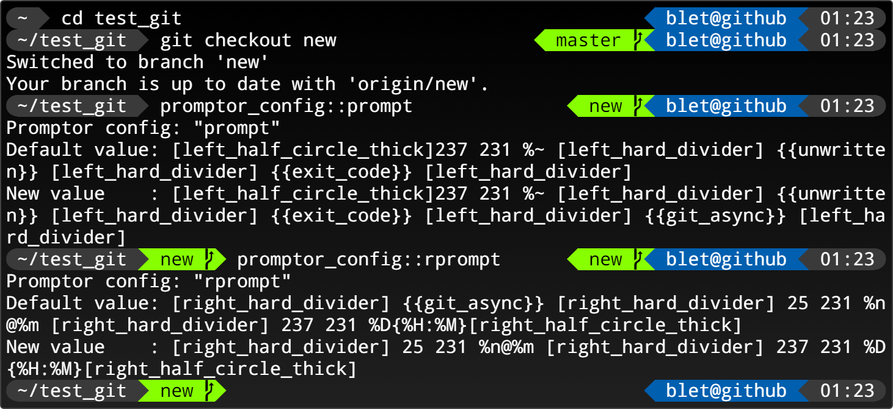

# Promptor

<p align="center">
  
</p>

## Font
<a url="https://github.com/powerline/fonts">https://github.com/powerline/fonts</a>

## How to install ?
``` bash 
mkdir -p $HOME/.zshrc. d
cp -r promptor $HOME/.zshrc.d
```
``` bash
# add this in your $HOME/.zshrc
source "$HOME/.zshrc.d/promptor/promptor.zsh"
```
## Section
Add section in **promptor_config_prompt** or **promptor_config_rprompt**

{{ **BACKGROUND** **FOREGROUND** **CONTENT** }}

Change color of prompt
<p align="center">
  
</p>

## Function
Call functions in **promptor_config_prompt** and **promptor_config_rprompt** with {{ **FUNCTION** }}

~/.zshrc.d/promptor/promptor_functions/example
``` bash
# default configuration
promptor_config+=(
    [example.bg]=231
    [example.fg]=232
    [example.value]="foo bar"
)
# must be prefix by promptor_function_
promptor_function_example() {
    # the function must be print at least 3 arguments
    echo "${promptor_config[example.bg]}"    # BACKGROUND
    echo "${promptor_config[example.fg]}"    # FOREGROUND
    echo "${promptor_config[example.value]}" # CONTENT
}
```

Create automaticaly the manage function configurations:
- promptor_config_example_bg
- promptor_config_example_fg
- promptor_config_example_value

<p align="center">
  
</p>

## Configuration

Default configuration:
``` bash
$ promptor_config_list
git.active                     = "true"
git.bg                         = "237"
git.commit.bg                  = "226"
git.commit.fg                  = "232"
git.fg                         = "231"
git.remote.bg                  = "118"
git.remote.fg                  = "232"
max_command_title_size         = "100"
powerline                      = "false"
powerline_right_fill_character = "\ue0b0"
powerline_left_fill_character  = "\ue0b2"
prompt                         = "{{237 231 %~}}{{git}}{{unwritten}}"
rprompt                        = "{{25 231 %n@%m}}{{237 231 %D{%H:%M}}}"
title                          = "%n: %~"
unwritten.bg                   = "124"
unwritten.fg                   = "231"
```
