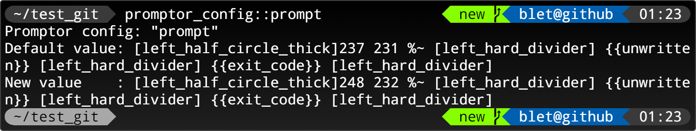
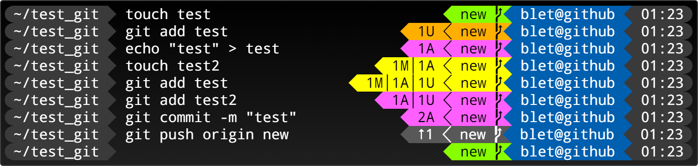

# Promptor

Customize your zsh prompt with powerline or nerd font. 

<p align="center">
  
</p>

## Fonts

<a url="https://www.nerdfonts.com/">https://www.nerdfonts.com/</a>  
<a url="https://github.com/powerline/fonts">https://github.com/powerline/fonts</a>

## How to install ?

``` bash
mkdir -p $HOME/.zshrc.d
cp -r promptor $HOME/.zshrc.d
```

``` bash
# add this in your $HOME/.zshrc
source "$HOME/.zshrc.d/promptor/promptor.zsh"
```

## Glyphs

<p align="center">
    
</p>

## Colors

<p align="center">
    
</p>

## Sections

Add section in **promptor_config::prompt** or **promptor_config::rprompt**.  
The sections are separate by `[{unicode_gliph}]`

A **section** can be contain a [Function](#function) or 3 Arguments (`background`, `foreground`, `content`).

### Examples:

#### Change colors of prompt

```bash
promptor_config::prompt "[\ue0b6]248 232 %~ [\ue0b0] unwritten [\ue0b0] exit_code [\ue0b0]"
```

<p align="center">
  
</p>

#### Bullet prompt

```bash
promptor_config::prompt "[\ue0b6]237 231 %~[\ue0b4][\ue0b6]unwritten[\ue0b4][\ue0b6]exit_code[\ue0b4]"
```

<p align="center">
  
</p>

## Function
Call functions in **promptor_config::prompt** and **promptor_config::rprompt** with `[{unicode_gliph}]{function_name}[{unicode_gliph}]`  
The functions take a agrument "**prompt**" or "**rprompt**"

### Git
With `git` or `git_async` functions you can show a color status.  
You can change or disable color piority sequence with: `promptor_config::git.color.sequence`  
You can change or disable information piority sequence with: `promptor_config::git.information.sequence`

<p align="center">
  
</p>

### Custion function
~/.zshrc.d/promptor/promptor_functions/example
``` bash
# default configuration
promptor_config+=(
    [example.bg]=231
    [example.fg]=232
    [example.value]="foo bar"
)
# must be prefix by promptor_function_
promptor_function_example() {
    local prompt="$1"
    # the function must be print at least 3 arguments
    echo "${promptor_config[example.bg]}"    # BACKGROUND
    echo "${promptor_config[example.fg]}"    # FOREGROUND
    echo "${promptor_config[example.value]}" # CONTENT
}
```

Create automaticaly the manage function configurations:
- promptor_config::example.bg
- promptor_config::example.fg
- promptor_config::example.value

<p align="center">
  
</p>

### Custion async function
~/.zshrc.d/promptor/promptor_functions/example_async
``` bash
# default configuration
promptor_config+=(
    [example.bg]=231
    [example.fg]=232
    [example.value]="foo bar"
)

# call by end of __my_example_slow_function (not required)
__my_example_callback() {
    local prompt="$1"
    local answer="$2"
    promptor_reload_prompt_from_function \
        example_async \
        "$answer"
}

# slow example function
__my_example_slow_function() {
    local prompt="$1"
    sleep 1
    echo "${promptor_config[example.bg]}"    # BACKGROUND
    echo "${promptor_config[example.fg]}"    # FOREGROUND
    echo "${promptor_config[example.value]}" # CONTENT
}

# must be prefix by promptor_worker_
promptor_worker_example_async() {
    local prompt="$1"
    promptor_launch_worker_job \
        example_async \
        "$prompt" \
        __my_example_slow_function \
        __my_example_callback
}

# execute before callback (not required)
# must be prefix by promptor_function_
promptor_function_example_async() {
    local prompt="$1"
    # the function must be print at least 3 arguments
    echo "${promptor_config[example.bg]}"    # BACKGROUND
    echo "${promptor_config[example.fg]}"    # FOREGROUND
    echo "..."                               # CONTENT
}
```

## Configuration

Default configuration:
``` bash
$ promptor_config_list
example.bg                                = "231"
example.fg                                = "232"
example.value                             = "foo bar"
exit_code.bg                              = "125"
exit_code.fg                              = "231"
git                                       = "true"
git.async.wait.bg                         = "234"
git.async.wait.character                  = "\uf250" ()
git.async.wait.fg                         = "231"
git.character.added                       = "A"
git.character.branch                      = "\u26d5" (⛕)
git.character.dirty                       = "M"
git.character.hash                        = "\u2d4c" (ⵌ)
git.character.separator                   = "\u2502" (│)
git.character.separator.prompt            = "\u2503" (┃)
git.character.separator.rprompt           = "\u2503" (┃)
git.character.stash                       = "S"
git.character.tag                         = "\uf02b" ()
git.character.untracked                   = "U"
git.character.upstream.left               = "\u2b63" (⭣)
git.character.upstream.right              = "\u2b61" (⭡)
git.color.added.bg                        = "207"
git.color.added.fg                        = "232"
git.color.bg                              = "240"
git.color.conflict.bg                     = "124"
git.color.conflict.fg                     = "231"
git.color.detached.bg                     = "97"
git.color.detached.fg                     = "231"
git.color.dirty.bg                        = "226"
git.color.dirty.fg                        = "232"
git.color.fg                              = "231"
git.color.remote.bg                       = "118"
git.color.remote.fg                       = "232"
git.color.sequence                        = "conflict dirty added untracked detached remote"
git.color.untracked.bg                    = "214"
git.color.untracked.fg                    = "232"
git.compress.sparse.state                 = "true"
git.describe.style                        = "tag"
git.hide_if_pwd_ignored                   = "false"
git.information.sequence                  = "dirty added untracked stash upstream"
git.omit.sparse.state                     = "true"
git.powerline.character.added             = "A"
git.powerline.character.branch            = "\ue0a0" ()
git.powerline.character.dirty             = "M"
git.powerline.character.hash              = "\u2d4c" (ⵌ)
git.powerline.character.separator         = "\u2502" (│)
git.powerline.character.separator.prompt  = "\ue0b1" ()
git.powerline.character.separator.rprompt = "\ue0b3" ()
git.powerline.character.stash             = "S"
git.powerline.character.tag               = "\uf02b" ()
git.powerline.character.untracked         = "U"
git.powerline.character.upstream.left     = "\u2b63" (⭣)
git.powerline.character.upstream.right    = "\u2b61" (⭡)
git.show.upstream                         = "verbose"
powerline                                 = "true"
prompt                                    = "[\ue0b6]237 231 %~ [\ue0b0] unwritten [\ue0b0] exit_code [\ue0b0]" ([]237 231 %~ [] unwritten [] exit_code [])
rprompt                                   = "[\ue0b2] git_async [\ue0b2] 25 231 %n@%m [\ue0b2] 237 231 %D{%H:%M}[\ue0b4]" ([] git_async [] 25 231 %n@%m [] 237 231 %D{%H:%M}[])
title                                     = "%n: %~"
title.command.max_size                    = "100"
unwritten.bg                              = "124"
unwritten.fg                              = "231"
```
